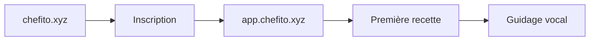
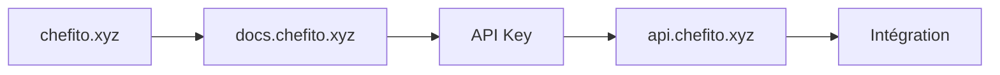

# 🌐 Stratégie de Sous-domaines Chefito - Guide Complet

## 🎯 **Vision Globale**

L'architecture de sous-domaines de Chefito vise à créer un écosystème modulaire, scalable et professionnel qui sépare clairement les responsabilités tout en offrant une expérience utilisateur fluide.

## 📊 **Mapping des Sous-domaines**

### **🏠 Domaine Principal**
- **`chefito.xyz`**
  - **Rôle:** Site vitrine et marketing
  - **Contenu:** Landing page, présentation, blog, SEO
  - **Audience:** Visiteurs découvrant Chefito
  - **Technologies:** Next.js, optimisé SEO

### **📱 Application Web**
- **`app.chefito.xyz`**
  - **Rôle:** Application web complète
  - **Contenu:** Recettes, guidage vocal, assistant IA
  - **Audience:** Utilisateurs authentifiés
  - **Technologies:** Next.js, PWA, WebRTC

### **🔌 API Publique**
- **`api.chefito.xyz`**
  - **Rôle:** API REST publique
  - **Contenu:** Endpoints pour développeurs tiers
  - **Audience:** Développeurs, intégrations
  - **Technologies:** Node.js, Express, documentation OpenAPI

### **⚙️ Administration**
- **`admin.chefito.xyz`**
  - **Rôle:** Interface d'administration
  - **Contenu:** Gestion recettes, utilisateurs, analytics
  - **Audience:** Équipe Chefito, modérateurs
  - **Technologies:** Next.js, dashboard avancé

### **📚 Documentation**
- **`docs.chefito.xyz`**
  - **Rôle:** Documentation technique
  - **Contenu:** API docs, guides développeurs, SDK
  - **Audience:** Développeurs, partenaires
  - **Technologies:** Docusaurus, Markdown

### **🚀 CDN et Assets**
- **`cdn.chefito.xyz`**
  - **Rôle:** Distribution de contenu
  - **Contenu:** Images, CSS, JS, fonts
  - **Audience:** Tous les services
  - **Technologies:** Netlify CDN, optimisation automatique

## 🔄 **Flux Utilisateur Cross-Domain**

### **Parcours Découverte → Application**


### **Parcours Développeur**


## 🛡️ **Sécurité Cross-Domain**

### **Authentification Unifiée (SSO)**
```javascript
// Service d'authentification partagée
class ChefitoCrossAuth {
  constructor() {
    this.domains = [
      'chefito.xyz',
      'app.chefito.xyz', 
      'admin.chefito.xyz',
      'docs.chefito.xyz'
    ];
  }

  async signIn(credentials) {
    const token = await this.authenticate(credentials);
    
    // Synchroniser sur tous les domaines
    await Promise.all(
      this.domains.map(domain => 
        this.setTokenOnDomain(domain, token)
      )
    );
    
    return token;
  }

  async signOut() {
    // Déconnexion sur tous les domaines
    await Promise.all(
      this.domains.map(domain => 
        this.clearTokenOnDomain(domain)
      )
    );
  }
}
```

### **CORS Configuration Avancée**
```javascript
// Configuration CORS granulaire
const corsConfig = {
  'api.chefito.xyz': {
    allowedOrigins: [
      'https://chefito.xyz',
      'https://app.chefito.xyz',
      'https://admin.chefito.xyz'
    ],
    allowedMethods: ['GET', 'POST', 'PUT', 'DELETE'],
    allowCredentials: true
  },
  'cdn.chefito.xyz': {
    allowedOrigins: ['*'],
    allowedMethods: ['GET'],
    allowCredentials: false
  }
};
```

## 📈 **Performance et Optimisation**

### **Stratégie de Cache par Domaine**
```javascript
const cacheStrategies = {
  'chefito.xyz': {
    static: '1 year',
    pages: '1 hour',
    api: '5 minutes'
  },
  'app.chefito.xyz': {
    static: '1 year',
    data: '1 minute',
    realtime: 'no-cache'
  },
  'cdn.chefito.xyz': {
    images: '1 month',
    assets: '1 year',
    fonts: '1 year'
  }
};
```

### **Optimisation des Ressources**
```javascript
// Chargement intelligent des ressources
class ResourceLoader {
  loadFromCDN(resource) {
    const cdnUrl = `https://cdn.chefito.xyz/${resource}`;
    const fallbackUrl = `https://app.chefito.xyz/assets/${resource}`;
    
    return this.loadWithFallback(cdnUrl, fallbackUrl);
  }
}
```

## 🔍 **Monitoring et Analytics**

### **Tracking Cross-Domain**
```javascript
// Analytics unifiées
class ChefitoCrossAnalytics {
  track(event, properties = {}) {
    const enrichedProperties = {
      ...properties,
      domain: window.location.hostname,
      timestamp: Date.now(),
      sessionId: this.getSessionId(),
      userId: this.getUserId()
    };
    
    // Envoyer à tous les services d'analytics
    this.sendToGA(event, enrichedProperties);
    this.sendToMixpanel(event, enrichedProperties);
    this.sendToCustomAnalytics(event, enrichedProperties);
  }
}
```

### **Health Checks Automatisés**
```javascript
// Monitoring de santé des sous-domaines
const healthChecks = {
  'chefito.xyz': {
    endpoint: '/health',
    interval: '1m',
    timeout: '5s'
  },
  'app.chefito.xyz': {
    endpoint: '/api/health',
    interval: '30s',
    timeout: '3s'
  },
  'api.chefito.xyz': {
    endpoint: '/v1/health',
    interval: '15s',
    timeout: '2s'
  }
};
```

## 🚀 **Déploiement et CI/CD**

### **Pipeline de Déploiement**
```yaml
# .github/workflows/deploy-subdomains.yml
name: Deploy Chefito Subdomains

on:
  push:
    branches: [main, app, api, admin, docs]

jobs:
  deploy-main:
    if: github.ref == 'refs/heads/main'
    runs-on: ubuntu-latest
    steps:
      - uses: actions/checkout@v3
      - name: Deploy to chefito.xyz
        run: netlify deploy --prod --site chefito-main

  deploy-app:
    if: github.ref == 'refs/heads/app'
    runs-on: ubuntu-latest
    steps:
      - uses: actions/checkout@v3
      - name: Deploy to app.chefito.xyz
        run: netlify deploy --prod --site app-chefito

  deploy-api:
    if: github.ref == 'refs/heads/api'
    runs-on: ubuntu-latest
    steps:
      - uses: actions/checkout@v3
      - name: Deploy to api.chefito.xyz
        run: netlify deploy --prod --site api-chefito
```

## 🎨 **Design System Cross-Domain**

### **Composants Partagés**
```javascript
// Package UI partagé
@chefito/ui-components
├── Button/
├── Card/
├── Navigation/
├── Modal/
└── themes/
    ├── main.css      # Pour chefito.xyz
    ├── app.css       # Pour app.chefito.xyz
    └── admin.css     # Pour admin.chefito.xyz
```

### **Thèmes Adaptatifs**
```css
/* Thème principal (chefito.xyz) */
:root {
  --primary: #f97316;
  --secondary: #22c55e;
  --accent: #3b82f6;
}

/* Thème application (app.chefito.xyz) */
[data-theme="app"] {
  --primary: #f97316;
  --secondary: #10b981;
  --accent: #6366f1;
}

/* Thème admin (admin.chefito.xyz) */
[data-theme="admin"] {
  --primary: #dc2626;
  --secondary: #059669;
  --accent: #7c3aed;
}
```

## 📱 **Progressive Web App (PWA)**

### **Configuration PWA pour app.chefito.xyz**
```json
{
  "name": "Chefito - Assistant Culinaire",
  "short_name": "Chefito",
  "start_url": "https://app.chefito.xyz",
  "display": "standalone",
  "background_color": "#ffffff",
  "theme_color": "#f97316",
  "icons": [
    {
      "src": "https://cdn.chefito.xyz/icons/icon-192.png",
      "sizes": "192x192",
      "type": "image/png"
    }
  ],
  "shortcuts": [
    {
      "name": "Nouvelle recette",
      "url": "https://app.chefito.xyz/recipes/new",
      "icons": [{"src": "https://cdn.chefito.xyz/icons/new-recipe.png", "sizes": "96x96"}]
    }
  ]
}
```

## 🌍 **Internationalisation**

### **Sous-domaines Géographiques (Future)**
```javascript
const i18nConfig = {
  'fr.chefito.xyz': {
    locale: 'fr-FR',
    currency: 'EUR',
    timezone: 'Europe/Paris'
  },
  'en.chefito.xyz': {
    locale: 'en-US',
    currency: 'USD',
    timezone: 'America/New_York'
  },
  'es.chefito.xyz': {
    locale: 'es-ES',
    currency: 'EUR',
    timezone: 'Europe/Madrid'
  }
};
```

## 🔮 **Roadmap Future**

### **Phase 1: Foundation (Hackathon)**
- ✅ Configuration DNS et Netlify
- ✅ Séparation app.chefito.xyz
- ✅ API basique sur api.chefito.xyz

### **Phase 2: Enhancement (Post-hackathon)**
- 🔄 CDN optimisé sur cdn.chefito.xyz
- 🔄 Documentation complète sur docs.chefito.xyz
- 🔄 Interface admin sur admin.chefito.xyz

### **Phase 3: Scale (Long terme)**
- 🔮 API publique complète
- 🔮 Widgets intégrables
- 🔮 Expansion internationale
- 🔮 Marketplace de recettes

---

**🎯 Cette stratégie de sous-domaines positionne Chefito comme une plateforme professionnelle et scalable, prête pour le hackathon et l'expansion future !**